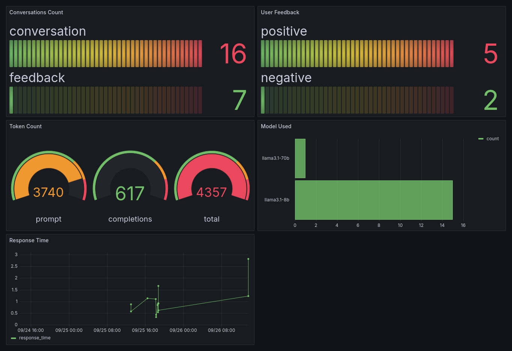

<div align="center">

# RAG Frontend with Monitoring

</div>

## Project Overview

This repository is RAG application where a knowledge base stores data and the user can send a query via a frontend and an LLM is used to generate the answer. The database provided contains the text chunks and embeddings for a few sample research papers.

## Tools Used

- **Amazon Bedrock:** For access to the Llama 3.1 Models
- **LanceDB:** As the database/knowledge base
- **Docker (Compose):** To containerize the different components
- **Grafana:** To display the metrics logged in the PostgreSQL database
- **Streamlit:** The frontend UI
- **Kestra:** Data ingestion workflow
- **PostgreSQL:** The Relational database used to store metrics such as tokens, feedback, model usage etc.

## Launching the App

First, build the frontend in the `frontend` folder using

```
docker build -t frontend .
```

Then, start the stack using

```
docker compose up
```

**Iff** you need to add more data, you can run the `ingest.ipynb` notebook as a quick hack.  
**Be careful** since the volume directory already has the dataset ingested beforehand!

Notes:

- First, minio (an S3 compatible storage) was used for storing LanceDB database. Unfortunately, it doesn't support text-search as of now. So LanceDB is stored on disk directly.
- The app is designed to be used with Amazon Bedrock. You need to provide credentials in the `.env` file to run the app. If using any other provider/API, feel free to modify the `llm.py` file.

## Grafana Dashboard

Grafana is used to deploy a few metrics e.g.

- number of conversations
- user feedback count (positive vs negative)
- token count
- model used
- response time

Using volume mounts, the dashboard and datasources are automatically set up along the docker image.



## Folder Structure

```sh
└── rag-with-eval
    └── 📁data                              # Folder that contains pdf files as a source
    └── 📁docker                            # Holds config files to be mounted for docker containers
        └── 📁grafana                       # pre-populated grafana dashboard and datasource
    └── 📁evaluation                        # Top-level directory for our evaluation
        └── 📁db                            # directory where database will be stored (chunks, embeddings)
        └── 📁img                           # images of sample outputs as well as results
        └── 📁results                       # results from each step in our evaluation
        └── 📁script
            └── evaluate.py                 # top-level functions to evaluate the dataset
            └── ingest.py                   # Inserts data  into the vector database
            └── parse.py                    # used to create splits of our documents
            └── prompts.py                  # Defines our prompts for LLM-as-a-Judge and RAG
            └── query.py                    # Defines our helper functions to invoke LLMsquery the database
            └── score.py                    # Defines our helper functions to evaluate retireval
        └── 📁utils
            └── config.py                   # function to get project root
            └── embeddings.py               # Defines our helper functions to create embeddings
            └── id_gen.py                   # A simple function to create hashes out of text strings
            └── models.py                   # Defines our helper functions to invoke LLMs
            └── vecdb.py                    # contains functions to create/load LanceDB table
        └── .env                            # Loads environment variable for invoking AWS/Together
        └── evaluate.ipynb                  # Notebook to run the evaluation steps
        └── README.md                       # README for the evaluation
    └── 📁frontend                          # Top level directory for the frontend docker image
        └── app.py                          # Entry-point for the Streamlit UI
        └── db.py                           # Contains python functions to interact with the PostgreSQL database
        └── Dockerfile                      # Dockerfile for the frontend container
        └── llm.py                          # Contains Python functions to invoke the LLM as well as the prompt templates
        └── requirements.txt                # Lists of Python dependencies for the project
        └── sqlqueries.py                   # Contains SQL queries needed to ingest metrics into the PostgreSQL database
        └── util.py                         # Contains Python functions for rerankers, embedding models, searching vector database
    └── 📁img                               # Images displayed on Github README
        └── grafana_dashboard.png           # A sample image for the deployed Grafana dashboard
    └── 📁volumes                           # Volume mounts for the different containers
    └── .env                                # Loads environment variable for invoking AWS/Together
    └── docker-compose.yml                  # Docker compose for launching the different containers.
    └── ingest.ipynb                        # A quick-hack setup for ingesting (more) data into the vector database
    └── README.md                           # You are here!
```


## Evaluation

Both retrieval and generation evaluation has been done. For the former, hit-rate and MRR were used as the metrics and for the latter, we use [Prometheus 2 (7B)](https://github.com/prometheus-eval/prometheus-eval) as the LLM-as-a-judge evaluator.

For details, see [here](./evaluation/README.md)
