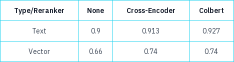
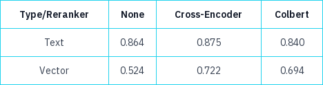

# Evaluation

## A note on Prometheus 2
[Prometheus](https://github.com/prometheus-eval/prometheus-eval) is an LLM designed to evaluate responsed generated by a model. It is intended to replace human evaluation which can be expensive. They claim better results than GPT4 in evaluating responses.

For Prometheus, we have to supply it with a grading rubric and it will output the feedback as well as the score. It supports two kinds of mode; absolute and relative.

Since we have only one model, we use the abolsute grading. It further supports comparing with a reference or a ground truth or without a reference.

## QnA Filtering

We use Prometheus 2 (7B) to filter out any question-answer pairs where the question is not fully grounded in the context (and maybe the QnA generation was based on LLM's internal knowledge). We use the absolute grading **without** reference to evalute the synthetic QnA dataset.

## Retrieval

We use the hit-rate and MRR as a metric to evaluate the retrieval. Once the scores are populated for all possible configurations, only the top-scoring configuration (text search with cross-encoder in our case) was used to proceed for the generation phase.

## Generation

Prometheus 2 (7B) was used to evaluate the text generated against the ground truth answers. We use the absolute grading **with** reference to evalute the synthetic QnA dataset.

## Results

#### Hit-Rate

#### MRR

#### Generation

Using Prometheus 2 (7B), the average feedback score was 4.32 (on a scale of 5)

Caveats:

- If references are in the appendix, the LLM would generate questions like who wrote the paper X in the year Y. That is why they were excluded from the PDF files.
- Use the `judge.absolute_grade` method instead of `judge.single_absolute_grade`. Else the text generation will be too slow - really slow!
